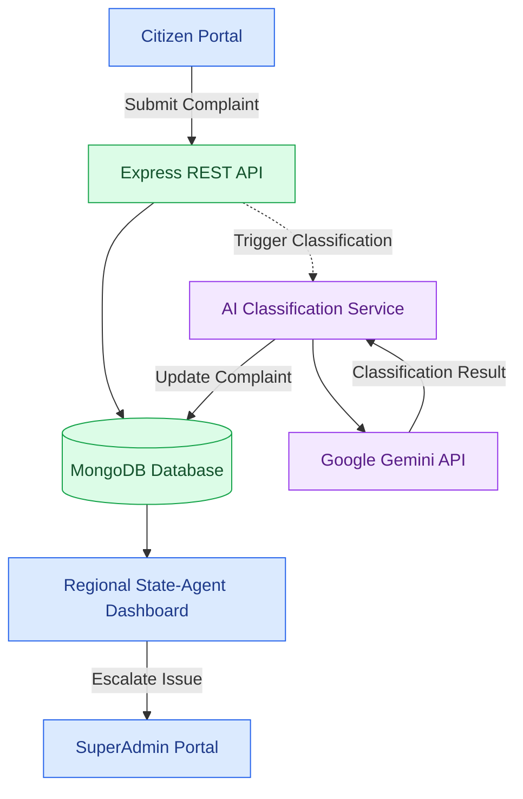

# 🏛️ CivicPulse

### AI-Powered Regional Civic Governance & Complaint Management Platform

<p align="center">
  <strong>Transforming citizen grievances into actionable insights through AI-powered classification, regional monitoring, and intelligent escalation.</strong>
</p>

<p align="center">
  
  
  
  
  
</p>

<p align="center">
  <a href="#-key-features">Features</a> •
  <a href="#-system-architecture">Architecture</a> •
  <a href="#-tech-stack">Tech Stack</a> •
  <a href="#-getting-started">Installation</a> •
  <a href="#-api-documentation">API Documentation</a> •
  <a href="#-future-roadmap">Roadmap</a>
</p>

---
## Citizen dashboard pages


---
## Some Admin dashboard pages


## 📌 Executive Summary

Municipal authorities and regional administrations receive civic complaints involving damaged roads, water leakage, sanitation, electricity failures, drainage problems, and other public infrastructure issues.

Managing these grievances efficiently can be challenging due to manual categorization, incorrect departmental routing, limited regional visibility, and delayed escalation of unresolved complaints.

**CivicPulse** is an AI-powered civic issue management platform designed to streamline this process. By integrating the Google Gemini API with a MERN stack application, CivicPulse helps classify citizen complaints, organize issues by region and status, and provide administrators with a centralized complaint management interface.

The platform aims to make civic grievance handling more organized, responsive, and transparent.

### 🎯 Vision

Build a smarter civic governance ecosystem where citizen-reported problems can be categorized, routed, monitored, and escalated through a structured, technology-driven workflow.

---

## 🚨 Problem Statement

Traditional civic grievance workflows may encounter the following challenges:

* **Manual complaint triage:** Administrators must review and categorize individual complaints.
* **Incorrect department assignment:** Complaints can be routed to departments that are not responsible for the reported issue.
* **Limited regional visibility:** Managing complaints across multiple states or regions can become difficult.
* **Delayed escalation:** Urgent or unresolved complaints may not receive timely administrative attention.
* **Fragmented monitoring:** Administrators need a convenient way to review complaint statuses and identify pending issues.

CivicPulse addresses these challenges through AI-assisted classification, regional filtering, and centralized complaint monitoring.

---

## ⚡ Traditional Systems vs. CivicPulse

| Traditional Approach                          | CivicPulse Approach                             |
| --------------------------------------------- | ----------------------------------------------- |
| Manual complaint categorization               | AI-assisted complaint classification            |
| Repetitive manual department routing          | Suggested department based on complaint context |
| Limited regional organization                 | Region-aware complaint filtering                |
| Difficult identification of unresolved issues | Status-based complaint monitoring               |
| Manual escalation workflows                   | Structured escalation to higher-level oversight |
| Separate complaint handling processes         | Centralized complaint management interface      |

---

## ✨ Key Features

### 🤖 1. AI-Powered Complaint Classification

CivicPulse integrates Google Gemini to analyze complaint titles and descriptions.

* Uses natural-language understanding to interpret citizen-reported issues.
* Identifies likely complaint categories and responsible departments.
* Supports categories such as:

  * 🛣️ Roads and Infrastructure
  * 💧 Water Supply
  * 🧹 Sanitation
  * ⚡ Electricity
  * 🚰 Drainage
  * 🚔 Police and Public Safety
* Helps reduce the need for manual initial classification.

**Example**

Input:

> "A large pothole near the college entrance is blocking traffic and creating a safety risk."

Expected classification: `Roads`

*Classification results depend on the AI response and the application's configured category mapping.*

### ⚙️ 2. Event-Driven Processing

The backend can initiate AI classification in response to a new complaint rather than continuously polling for work.

* Connects complaint submission with the AI processing workflow.
* Separates API request handling from classification logic.
* Reduces unnecessary scheduled polling when event-triggered processing is used.
* Supports updating complaint records with classification results.

Background processing, retries, and failure recovery depend on the backend implementation.

### 🏙️ 3. Regional State-Agent Dashboard

A dedicated interface for reviewing and managing complaints within a selected region.

* Region-based complaint filtering.
* Organized complaint feed.
* Collapsible sidebar and structured dashboard layout.
* Status-based views for:

  * `ALL`
  * `PENDING`
  * `ASSIGNED`
  * `ESCALATED`
* Responsive interface using React and Tailwind CSS.
* Modern iconography using Lucide React.

### 🚨 4. Complaint Escalation Workflow

Enables State Agents to flag unresolved or high-priority complaints for higher-level review.

* One-click escalation action.
* Escalation visibility for SuperAdmin oversight.
* Clear visual indicators for complaint status.
* A foundation for structured follow-up and accountability.

### 📍 5. Location-Aware Complaint Management

Location information can help administrators organize complaints by region.

* Accepts complaint-related location details.
* Supports region-specific filtering.
* Helps separate complaints belonging to different administrative areas.
* Provides a foundation for future map-based complaint visualization.

The accuracy of regional assignment depends on the location data and parsing logic configured in the application.

---

## 🏗️ System Architecture

CivicPulse follows a modular MERN stack architecture with an AI classification component.



### 🔄 Complaint Processing Flow

1. **Submission:** A citizen submits a complaint through the frontend.
2. **API handling:** The Express backend receives and processes the request.
3. **Persistence:** The complaint is stored in MongoDB according to the configured workflow.
4. **AI classification:** The backend invokes the classification service, which communicates with Google Gemini.
5. **Classification update:** The result can be used to update the complaint category or department.
6. **Administrative review:** State Agents monitor complaints through the regional dashboard.
7. **Escalation:** Complaints requiring additional attention can be escalated to the SuperAdmin workflow.

*The exact execution order, response timing, and persistence guarantees depend on the implementation.*

---

## 🛠️ Tech Stack

### Frontend

| Technology       | Purpose                        |
| ---------------- | ------------------------------ |
| React.js         | Component-based user interface |
| Tailwind CSS     | Responsive styling and layout  |
| React Router DOM | Client-side navigation         |
| Lucide React     | UI icons                       |

### Backend

| Technology | Purpose                                   |
| ---------- | ----------------------------------------- |
| Node.js    | JavaScript runtime                        |
| Express.js | REST API and request handling             |
| MongoDB    | Complaint and application data storage    |
| Mongoose   | Schema definition and database operations |

### AI Integration

| Technology        | Purpose                                                |
| ----------------- | ------------------------------------------------------ |
| Google Gemini API | Natural-language complaint analysis and classification |

---

## 📂 Project Structure

```text
AdvCivicPulse/
│
├── backend/
│   ├── models/
│   │   └── reportSchema.js
│   │
│   ├── routes/
│   │   ├── agentRoutes.js
│   │   └── complaintRoutes.js
│   │
│   ├── stateAgent.js
│   └── server.js
│
├── frontend/
│   └── src/
│       ├── components/
│       │   ├── StateAgentLayout.jsx
│       │   └── StateAgentDashboardContent.jsx
│       │
│       └── App.jsx
│
└── README.md
```

### Core Modules

| Module                           | Responsibility                                          |
| -------------------------------- | ------------------------------------------------------- |
| `reportSchema.js`                | Defines the complaint data model                        |
| `complaintRoutes.js`             | Handles complaint submission and related processing     |
| `agentRoutes.js`                 | Provides state-agent dashboard and escalation endpoints |
| `stateAgent.js`                  | Contains AI-assisted classification logic               |
| `server.js`                      | Configures the Express server and database connection   |
| `StateAgentLayout.jsx`           | Defines the state-agent dashboard layout                |
| `StateAgentDashboardContent.jsx` | Displays complaints and filtering controls              |
| `App.jsx`                        | Configures frontend routes                              |

---

## 🚀 Getting Started

Follow these instructions to configure a local development environment.

### Prerequisites

Install the following tools and services:

* [Node.js](https://nodejs.org/)
* npm
* [MongoDB](https://www.mongodb.com/) or MongoDB Atlas
* [Google AI Studio](https://aistudio.google.com/) API key for Gemini access
* Git

### 1. Clone the Repository

```bash
git clone [https://github.com/harshajs816/CivicPulse-withAgent-.git]
cd AdvCivicPulse
```

Replace the placeholder with your actual repository URL.

### 2. Configure the Backend

```bash
cd backend
npm install
```

Create a `.env` file in the backend directory.

```env
PORT=5000
MONGODB_URI=your_mongodb_connection_string
GEMINI_API_KEY=your_gemini_api_key
```

Use the exact environment variable names referenced by your source code.

Start the backend using the script configured in `backend/package.json`. For example:

```bash
npm run dev
```

If your project uses a different script, run the corresponding command.

### 3. Configure the Frontend

Open another terminal:

```bash
cd frontend
npm install
```

If your frontend uses Vite, create a `.env` file in the frontend directory:

```env
VITE_API_URL=http://localhost:5000
```

Configure the value according to the API URL convention used in your frontend. If the application already appends `/api`, avoid duplicating that path.

Start the frontend:

```bash
npm run dev
```

Open the local development URL displayed in the terminal.

### 4. Verify the Setup

* Confirm that the backend starts successfully.
* Verify that the MongoDB connection is established.
* Confirm that the frontend can communicate with the backend.
* Test complaint submission using the configured API.
* Verify AI classification with a valid Gemini API key.
* Check regional filtering and escalation using appropriate test records.

---

## 🔐 Environment Variables

| Variable         | Description               | Required                          |
| ---------------- | ------------------------- | --------------------------------- |
| `PORT`           | Backend server port       | Depends on configuration          |
| `MONGODB_URI`    | MongoDB connection string | Yes for database connectivity     |
| `GEMINI_API_KEY` | Google Gemini API key     | Yes for Gemini integration        |
| `VITE_API_URL`   | Frontend API base URL     | Depends on frontend configuration |

### Security Best Practices

* Never commit `.env` files or API credentials to GitHub.
* Add sensitive environment files to `.gitignore`.
* Keep Gemini API credentials exclusively on the server.
* Validate and sanitize incoming request data.
* Apply appropriate CORS configuration.
* Add authentication and role-based authorization to protected administrative routes.
* Handle AI failures and database errors gracefully.

---

## 📡 API Documentation

The following table describes the API areas indicated by the project structure. Confirm the actual endpoint paths, HTTP methods, and request schemas in your Express route files before publishing them as a complete API reference.

| API Area           | Purpose                                     |
| ------------------ | ------------------------------------------- |
| Complaint Routes   | Submit and process citizen complaints       |
| State-Agent Routes | Retrieve and filter regional complaints     |
| Escalation Routes  | Escalate complaints for higher-level review |

### Example Endpoint Documentation Format

Use this format to document each verified endpoint:

| Field          | Example                                    |
| -------------- | ------------------------------------------ |
| Method         | `POST`                                     |
| Endpoint       | `/api/<actual-complaint-route>`            |
| Request body   | Complaint title, description, and location |
| Response       | Created complaint or validation error      |
| Authentication | Specify the actual requirement             |

### Example Request Body

```json
{
  "title": "Road damage near the main market",
  "description": "A large pothole is causing traffic congestion.",
  "location": "Example locality, Example state"
}
```

*This is an illustrative request body, not a guarantee of the exact fields accepted by the current backend.*

---

## 🧪 Testing Checklist

Before deployment or demonstration, verify the following scenarios:

* [ ] Valid complaint submission.
* [ ] Validation of missing or invalid complaint fields.
* [ ] Correct AI category mapping for representative complaints.
* [ ] Graceful handling of Gemini API errors and rate limits.
* [ ] Correct persistence of complaint records.
* [ ] Accurate region-based filtering.
* [ ] Correct status filtering.
* [ ] Successful escalation workflow.
* [ ] Appropriate authorization for administrative actions.
* [ ] Responsive rendering on desktop and mobile.
* [ ] Protection of environment variables and API credentials.

---

## 🗺️ Future Roadmap

Potential enhancements for future versions include:

* [ ] Citizen complaint tracking with unique reference IDs.
* [ ] Automated notifications for status updates.
* [ ] SLA-based escalation for overdue complaints.
* [ ] Interactive regional maps and civic issue heatmaps.
* [ ] Department-wise analytics and resolution-time reporting.
* [ ] Multilingual complaint submission and AI classification.
* [ ] AI confidence scoring and manual review for uncertain predictions.
* [ ] Role-based access control for citizens, State Agents, and SuperAdmins.
* [ ] Image-based civic issue reporting.
* [ ] Audit logs and administrative activity tracking.
* [ ] Automated testing and production monitoring.
* [ ] Reliable background processing with retry and failure-recovery mechanisms.

These items describe possible future improvements and should not be interpreted as currently implemented functionality.

---

## 🤝 Contributing

Contributions, bug reports, and suggestions are welcome.

1. Fork the repository.

2. Create a feature branch:

   ```bash
   git checkout -b feature/your-feature-name
   ```

3. Implement and test your changes.

4. Commit your work:

   ```bash
   git commit -m "Add: describe your change"
   ```

5. Push the branch and open a pull request.

Please include a clear description of the change and any relevant testing details.

---


## 🌟 Project Vision

CivicPulse aims to make civic grievance management more organized by connecting citizen reporting, AI-assisted classification, regional monitoring, and administrative escalation in one platform.

<p align="center">
  <strong>🏛️ CivicPulse — Smarter Governance. Stronger Communities.</strong>
</p>

<p align="center">
  Built with the MERN stack and Google Gemini AI.
</p>
